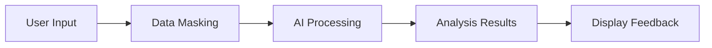

# Resume Analyzer 🎯

> **An AI-powered web application that analyzes resumes against job descriptions, providing ATS compatibility scores, skill gap analysis, and actionable improvement suggestions.**

[](https://www.python.org/downloads/)
[](https://nextjs.org/)
[](https://fastapi.tiangolo.com/)

---

## 📋 Table of Contents

- [Overview](#-overview)
- [Key Features](#-key-features)
- [How It Works](#-how-it-works)
- [Tech Stack](#-tech-stack)
- [Installation & Setup](#-installation--setup)
- [Project Structure](#-project-structure)
- [Privacy & Security](#-privacy--security)
- [Use Cases](#-use-cases)
- [Future Enhancements](#-future-enhancements)
- [Contributing](#-contributing)

---

## 🌟 Overview

Resume Analyzer helps job seekers optimize their resumes by intelligently comparing them against job descriptions. Using natural language processing and AI-powered analysis, it provides structured feedback, ATS scoring, and actionable suggestions to improve your chances of landing interviews.

**Perfect for job seekers who want to:**
- Tailor resumes for specific roles
- Improve ATS compatibility
- Identify skill gaps quickly
- Get data-driven resume feedback

---

## ✨ Key Features

| Feature | Description |
|---------|-------------|
| 🔍 **Smart Comparison** | Automatically compares resumes with job descriptions |
| 📊 **ATS Scoring** | Generates compatibility scores based on skill matching |
| 🧠 **Skill Analysis** | Highlights matched skills and identifies missing ones |
| 🔐 **Privacy First** | Masks sensitive data (email & phone) before processing |
| ⚡ **Real-time Results** | Instant feedback via interactive Next.js frontend |
| 🛡️ **Secure Backend** | FastAPI backend with secure AI API integration |

---

## 🧠 How It Works



### Step-by-Step Process

1. **Input** → User uploads or pastes resume and job description
2. **Security** → Backend masks private data (email & phone numbers)
3. **Processing** → Sanitized data sent to OpenRouter AI API
4. **Analysis** → AI returns:
   - ATS compatibility score
   - Matched skills
   - Missing skills
   - Improvement suggestions
5. **Output** → Results displayed instantly on the frontend

---

## 🛠 Tech Stack

### Frontend
- **Framework:** Next.js (React)
- **Language:** JavaScript / TypeScript
- **Styling:** CSS Modules / Tailwind (customize as needed)

### Backend
- **Framework:** FastAPI
- **Language:** Python 3.8+
- **API Integration:** OpenRouter (ChatGPT)

### NLP & Processing
- **Techniques:** Regex-based pattern matching
- **Libraries:** Python NLP libraries

### Development Tools
- VS Code
- Git
- Node.js

---

## 🚀 Installation & Setup

### ✅ Prerequisites

Before you begin, ensure you have:

- **Python** 3.8 or higher
- **Node.js** 14 or higher
- **Git**
- **OpenRouter API Key** ([Get it here](https://openrouter.ai/))

---

### 🔧 Backend Setup

```bash
# Clone the repository
git clone https://github.com/thevishwass/ResumeAnalyzer.git
cd ResumeAnalyzer

# Navigate to backend
cd backend

# Create virtual environment
python -m venv venv

# Activate virtual environment
.\venv\Scripts\activate      # Windows
# source venv/bin/activate   # Linux/Mac

# Install dependencies
pip install -r requirements.txt
```

#### Configure Environment Variables

Create a `.env` file in the `backend/` directory:

```env
OPENROUTER_API_KEY=your_api_key_here
```

> 🔑 **Get Your API Key:** Visit [OpenRouter.ai](https://openrouter.ai/) to obtain your API key

#### Run the Backend Server

```bash
uvicorn main:app --reload --host 0.0.0.0 --port 8000
```

✅ **Backend will be running at:** `http://localhost:8000`

---

### 🌐 Frontend Setup

```bash
# From project root, navigate to frontend
cd frontend

# Install dependencies
npm install

# Start development server
npm run dev
```

✅ **Frontend will be running at:** `http://localhost:3000`

---

## 📂 Project Structure

```
ResumeAnalyzer/
│
├── backend/
│   ├── main.py              # FastAPI application entry point
│   ├── requirements.txt     # Python dependencies
│   ├── .env                 # Environment variables (create this)
│   └── utils/              # Helper functions and utilities
│
├── frontend/
│   ├── pages/              # Next.js pages
│   ├── components/         # React components
│   ├── styles/             # CSS/styling files
│   ├── package.json        # Node dependencies
│   └── next.config.js      # Next.js configuration
│
└── README.md               # Project documentation
```

---

## 🔐 Privacy & Security

Your privacy is our priority. Here's how we protect your data:

| Security Feature | Implementation |
|------------------|----------------|
| 🔒 **Data Masking** | Email addresses and phone numbers are automatically masked before API calls |
| 🛡️ **No Data Storage** | Sensitive information is never stored or logged |
| 🔑 **Secure API Keys** | Environment variables keep credentials safe |
| ✅ **Privacy First** | No personal data is sent to external services |

---

## 🎯 Use Cases

This tool is perfect for:

- 📝 **Job Seekers** – Optimize resumes for specific job applications
- 🎓 **Students** – Prepare resumes for internships and entry-level positions
- 🔄 **Career Switchers** – Identify transferable skills and gaps
- 💼 **Professionals** – Ensure ATS compatibility for better visibility
- 👥 **Career Counselors** – Help clients improve their resumes

---

## 📌 Future Enhancements

We're constantly improving! Planned features include:

- [ ] 📄 PDF resume upload support
- [ ] 🧮 Advanced skill similarity scoring using embeddings
- [ ] 🎨 Resume formatting and design suggestions
- [ ] 🐳 Docker deployment for easier setup
- [ ] 📊 Visual analytics dashboard
- [ ] 🌍 Multi-language support
- [ ] 💾 User accounts and history tracking
- [ ] 🤖 Custom AI model fine-tuning

---

## 🤝 Contributing

Contributions make the open-source community an amazing place to learn and create. Any contributions you make are **greatly appreciated**!

### How to Contribute

1. Fork the Project
2. Create your Feature Branch (`git checkout -b feature/AmazingFeature`)
3. Commit your Changes (`git commit -m 'Add some AmazingFeature'`)
4. Push to the Branch (`git push origin feature/AmazingFeature`)
5. Open a Pull Request

### Reporting Issues

Found a bug or have a suggestion? [Open an issue](https://github.com/thevishwass/ResumeAnalyzer/issues)

---

## 📬 Contact & Support

- **GitHub:** [@thevishwass](https://github.com/thevishwass)
- **Issues:** [Report a bug](https://github.com/thevishwass/ResumeAnalyzer/issues)
- **Discussions:** [Join the conversation](https://github.com/thevishwass/ResumeAnalyzer/discussions)

---

## 📄 License

This project is licensed under the MIT License - see the [LICENSE](LICENSE) file for details.

---

## ⭐ Show Your Support

If this project helped you, please consider giving it a ⭐ on GitHub!

---

### 🚀 **Deployment Suggestions:**

- **Frontend:** Deploy on [Vercel](https://vercel.com) (free, perfect for Next.js)
- **Backend:** Deploy on [Render](https://render.com) or [Railway](https://railway.app)
- **Database (if needed):** MongoDB Atlas or Supabase

---

<div align="center">

**Made by [@thevishwass](https://github.com/thevishwass)**

[Back to Top](#resume-analyzer)

</div>
